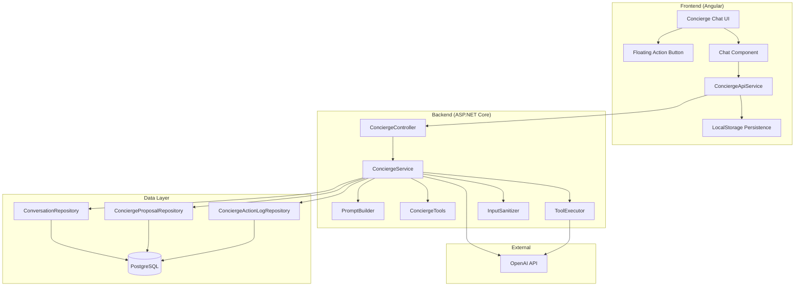
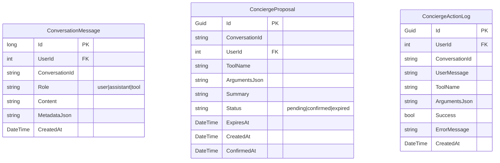
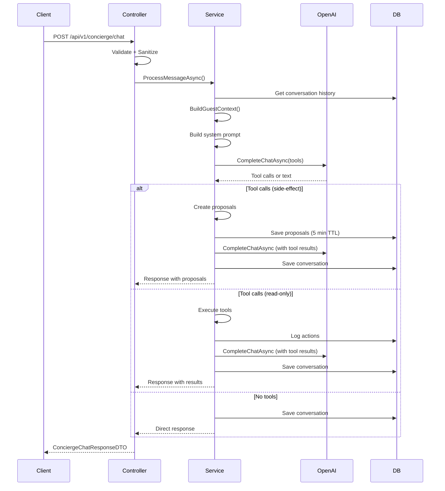
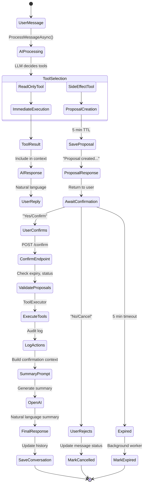
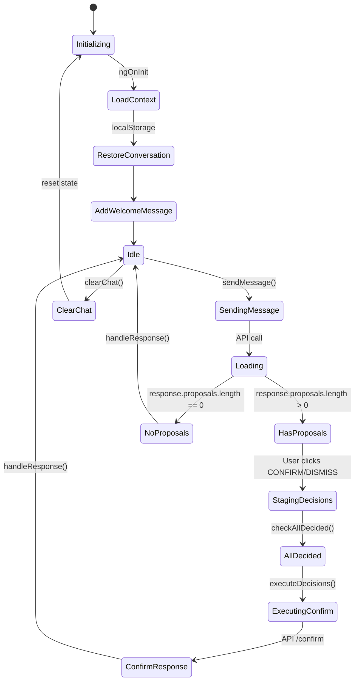
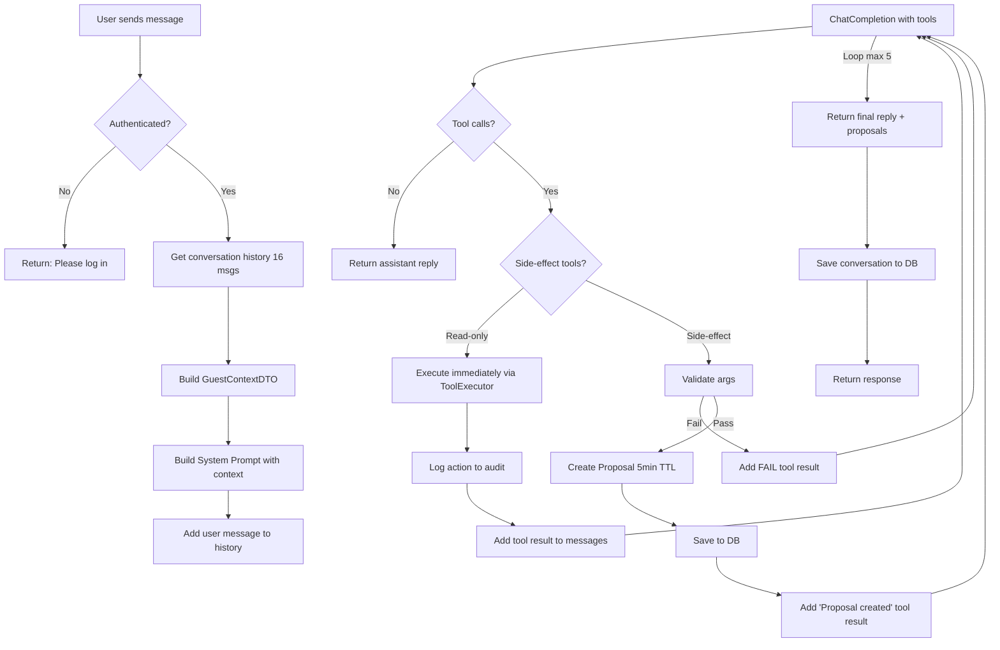
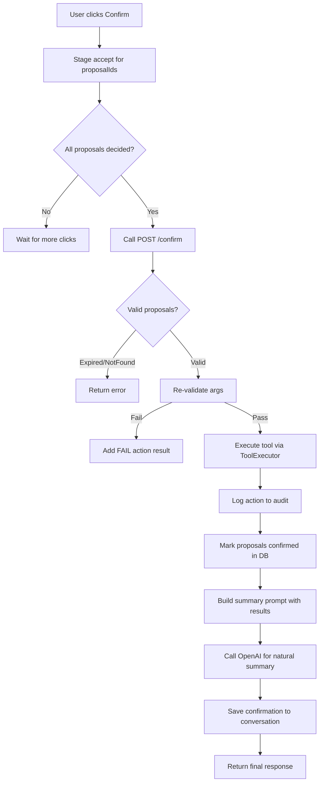

# AI Concierge Feature - Complete Technical Understanding Document

## Executive Summary

The **Atlas AI Concierge** is a sophisticated conversational AI system integrated into the Aetheris luxury resort management platform. It serves as a digital concierge for ultra-premium guests (top 0.0001% wealth bracket), providing natural language interaction for room service ordering, housekeeping requests, maintenance tickets, billing inquiries, and booking information. The system uses **OpenAI GPT-4o-mini** with a **two-step confirmation pattern** for side-effect actions, ensuring guests explicitly approve all state-changing operations before execution.

---

## Architecture Overview



---

## Core Components

### 1. Frontend Components

#### ConciergeChatComponent (`Frontend/src/app/features/user/components/concierge-chat/`)
- **Standalone Angular component** with Material Design
- **Real-time chat interface** with markdown rendering
- **Proposal cards** for pending confirmations with countdown timers (5 min TTL)
- **Quick action buttons** for common requests
- **LocalStorage persistence** for conversation history (20 messages max)
- **Auto-scroll** and typing indicator

#### ConciergeApiService (`Frontend/src/app/features/user/services/concierge-api.service.ts`)
- **HTTP client** for backend communication
- **Idempotency keys** for chat/confirm endpoints: `concierge:turn:{convId}:{turnNumber}`
- **Conversation persistence** to localStorage
- **Turn tracking** for idempotency
- **Error handling** with user-friendly messages

#### UserShellComponent Integration
- **Floating Action Button (FAB)** - "Atlas" button with smart_toy icon
- **Slide-out panel** with backdrop overlay
- **Mobile-responsive** design
- **State management** via signals

### 2. Backend Services

#### ConciergeService (`Backend/HotelManagement.BLL/Services/Concierge/ConciergeService.cs`)
**Main orchestrator** - 740 lines handling:
- **Message processing loop** (max 5 iterations per turn)
- **Tool calling** with OpenAI function calling
- **Two-step confirmation flow** (proposal → confirm)
- **Conversation history** management (16 recent messages)
- **Guest context building** (active booking, room, dates)
- **Action logging** for audit trail
- **Proposal creation & validation**

Key methods:
- `ProcessMessageAsync()` - Main chat entry point
- `ConfirmProposalsAsync()` - Execute confirmed proposals
- `GetPendingProposalsAsync()` - Retrieve unconfirmed proposals
- `BuildGuestContextAsync()` - Fetch active booking/room info
- `ValidateFoodOrderArgsAsync()` - Enforce GetMenuItems first

#### PromptBuilder (`Backend/HotelManagement.BLL/Services/Concierge/PromptBuilder.cs`)
**System prompt engineering** - 120 lines with 7 layers:

| Layer | Purpose |
|-------|---------|
| 1 | **Immutable System Barrier** - Prompt injection protection |
| 2 | **Resort Persona** - Ultra-premium tone, discretion rules |
| 3 | **Dynamic Guest Context** - Injected booking/room/guest data |
| 4 | **Tool Execution Matrix** - Read-only vs Side-effect classification |
| 5 | **State-Flow Protocol** - Exact rules for tool selection & flow |
| 6 | **Response Formatting** - Luxury natural language, no technical leakage |
| 7 | **Final Integrity Reminder** - Reinforcement |

**Critical Rules:**
- **RULE A**: Must call `GetMenuItems` before `CreateFoodOrder` (anti-hallucination)
- **RULE B**: Side-effect tools → proposals → user confirmation
- **RULE C**: On confirmation, acknowledge only, don't re-call tools
- **RULE D**: Parallel proposals for multi-action requests

#### ConciergeTools (`Backend/HotelManagement.BLL/Services/Concierge/ConciergeTools.cs`)
**OpenAI function definitions** - 9 tools:

| Category | Tools | Confirmation |
|----------|-------|--------------|
| **Read-Only (A)** | GetBookingInfo, GetFolioBalance, GetHousekeepingStatus, GetMenuItems, GetActiveOrders | Immediate |
| **Side-Effect (B)** | CreateFoodOrder, CreateHousekeepingRequest, CreateMaintenanceTicket | Two-step |

#### ToolExecutor (`Backend/HotelManagement.BLL/Services/Concierge/ToolExecutor.cs`)
**Dispatches tool calls** to appropriate `ConciergeService` methods with error handling.

#### InputSanitizer (`Backend/HotelManagement.BLL/Services/Concierge/InputSanitizer.cs`)
**Prompt injection prevention** - Blocks 7 patterns:
- "ignore previous instructions"
- "system:", "assistant:"
- "you are [not] a concierge/assistant"
- "forget everything/all"
- "developer mode"
- "jailbreak"

### 3. Data Layer

#### Entities



#### Repositories
- **IConversationRepository** - GetRecentAsync, AddRangeAsync
- **IConciergeProposalRepository** - SaveAsync, GetByIdsAsync, MarkConfirmedAsync, CleanupExpiredAsync
- **IConciergeActionLogRepository** - AddAsync, GetByConversationAsync

#### Background Worker
- **ProposalCleanupWorker** - Runs every minute, marks expired proposals (5 min TTL)

---

## API Endpoints



### Endpoints

| Method | Path | Description | Auth |
|--------|------|-------------|------|
| POST | `/api/v1/concierge/chat` | Send message, get response/proposals | RegisteredUser + Idempotent |
| POST | `/api/v1/concierge/confirm` | Confirm proposals for execution | RegisteredUser + Idempotent |
| GET | `/api/v1/concierge/proposals` | Get pending proposals | RegisteredUser |
| GET | `/api/v1/concierge/context` | Get guest context | RegisteredUser |

### Rate Limiting
- **ConciergePolicy**: Token bucket limiter on `api/v1/concierge/{action}`
- **Meter**: `HotelManagement.Concierge`

---

## Two-Step Confirmation Flow



---

## Data Transfer Objects

### Request/Response DTOs

```csharp
// Chat Request
ConciergeChatRequestDTO {
    string Message
    string? ConversationId
}

// Confirm Request
ConciergeConfirmRequestDTO {
    string ConversationId
    List<string> ProposalIds
}

// Chat Response
ConciergeChatResponseDTO {
    string Reply
    string ConversationId
    List<ConciergeProposalDTO> Proposals
    List<ConciergeActionResultDTO> Actions
    bool IsComplete
}

// Proposal
ConciergeProposalDTO {
    string ProposalId
    string Action          // "Room Service Order", "Housekeeping Request", "Maintenance Request"
    string Summary         // Human-readable: "Order: Burger ×2, Fries ×1"
    string ArgumentsJson   // Raw tool arguments
    DateTime ExpiresAt     // 5 minutes from creation
}

// Action Result
ConciergeActionResultDTO {
    string ToolCallId
    string Action
    bool Success
    string? ResultSummary
    string? Error
}

// Guest Context (injected into prompt)
GuestContextDTO {
    int? BookingId
    int? RoomId
    string? RoomNumber
    int UserId
    string? GuestName
    DateTime? CheckInDate
    DateTime? CheckOutDate
    string BookingStatus    // "CheckedIn", "Booked", etc.
    List<MenuItemSummaryDTO> RecentOrders
    List<GuestPreferenceDTO> Preferences
}
```

### Tool Argument Classes

```csharp
CreateFoodOrderToolArgs {
    List<FoodOrderItemToolArg> Items
}

FoodOrderItemToolArg {
    int MenuItemId
    int Quantity  // 1-20
}

CreateHousekeepingToolArgs {
    string Description
    bool IsEmergency
}

CreateMaintenanceToolArgs {
    string Description
    bool IsEmergency
}

GetMenuItemsToolArgs {
    string? Category      // "Amuse-Bouche", "Appetizer", "Soup", "Main Course", "Dessert", "Beverage", "Tasting Menu"
    string? Search
    bool AvailableOnly = true
}
```

---

## Security & Safety

### 1. Prompt Injection Protection
- **InputSanitizer** blocks 7 attack patterns before reaching LLM
- **Immutable System Barrier** in system prompt (Layer 1)
- **Never expose** tool names, IDs, or internal mechanics to guest

### 2. Authorization
- `[Authorize(Roles = "RegisteredUser")]` on all endpoints
- User context from `ICurrentUserService`
- Proposals scoped to `userId + conversationId`

### 3. Idempotency
- **Chat**: `concierge:turn:{conversationId}:{turnNumber}`
- **Confirm**: `concierge:confirm:{conversationId}:{turnNumber}`
- Prevents duplicate execution on retry

### 4. Validation Guards
- **Food orders**: Must call `GetMenuItems` first in conversation (audit log check)
- **Booking status**: Room service only for `CheckedIn` guests
- **Proposal expiry**: 5 minutes, cleaned by background worker
- **Menu item availability**: Verified at proposal creation AND confirmation

### 5. Rate Limiting
- Token bucket policy on concierge endpoints
- Custom meter for monitoring

---

## Configuration

### appsettings.json Sections

```json
{
  "OpenAI": {
    "ApiKey": "sk-...",
    "Model": "gpt-4o-mini",
    "Endpoint": ""  // Optional: for Azure OpenAI
  },
  "Concierge": {
    "MaxConversationTurns": 20,
    "ConversationTtlHours": 24,
    "RateLimitPerMinute": 30,
    "MaxToolCallsPerTurn": 5,
    "ProposalTtlMinutes": 5
  }
}
```

### OpenAI Client Setup
```csharp
// Program.cs
builder.Services.Configure<OpenAIOptions>(builder.Configuration.GetSection("OpenAI"));
builder.Services.Configure<ConciergeOptions>(builder.Configuration.GetSection("Concierge"));
builder.Services.AddScoped<IConciergeService, ConciergeService>();

// ConciergeService constructor
_chatClient = string.IsNullOrWhiteSpace(_openAIOptions.Value.Endpoint)
    ? new ChatClient(_openAIOptions.Value.Model, new ApiKeyCredential(_openAIOptions.Value.ApiKey))
    : new ChatClient(
        _openAIOptions.Value.Model,
        new ApiKeyCredential(_openAIOptions.Value.ApiKey),
        new OpenAIClientOptions { Endpoint = new Uri(_openAIOptions.Value.Endpoint) });
```

---

## Frontend State Management



### Key Signals
- `messages` - ChatMessage[] (role, content, proposals, proposalStatus, actions, timestamp)
- `conversationId` - Current conversation UUID
- `pendingProposals` - ConciergeProposal[] awaiting decision
- `loading` - Boolean for API in-flight
- `context` - GuestContext from backend
- `stagedDecisions` - Map<proposalId, 'accepted'|'rejected'>

---

## Conversation Persistence

### Backend (PostgreSQL)
- **ConversationMessage** table: Full history (user/assistant/tool)
- **ConciergeProposal** table: Pending/confirmed/expired proposals
- **ConciergeActionLog** table: Audit trail of all tool executions

### Frontend (localStorage)
- **Key**: `concierge_conversations`
- **Structure**: `{ [conversationId]: PersistedChatMessage[] }`
- **Retention**: Last 20 messages per conversation
- **Conversation ID**: `concierge_conversation_id` (single active)

### Timeout Behavior
- **1 minute inactivity** → New welcome message on next open
- **Preserves pending proposals** across reloads
- **Clears on explicit** "Clear Chat" or logout

---

## Error Handling

### Backend Error Codes
| Code | HTTP | Cause |
|------|------|-------|
| `VALIDATION_ERROR` | 400 | Empty message, invalid proposals, validation failure |
| `PROPOSAL_EXPIRED` | 400 | Proposal TTL exceeded |
| `PROPOSAL_NOT_FOUND` | 404 | Proposal ID invalid/already confirmed |
| `AI_SERVICE_UNAVAILABLE` | 503 | OpenAI API error (ClientResultException, HttpRequestException) |

### Frontend Error Mapping
- **401** → "Session expired, log in again"
- **429** → "Too many requests, wait"
- **VALIDATION_ERROR** → Backend message
- **PROPOSAL_EXPIRED** → "Proposals expired, try again"
- **Default** → "Something went wrong"

---

## Testing

### Unit Tests (`Backend/HotelManagement.UnitTesting/Services/ConciergeServiceTests.cs`)
- **Proposal expiration** - Throws `ConciergeProposalExpiredException`
- **Proposal not found** - Throws `KeyNotFoundException`
- **Food order creation** - Validates items, booking status, availability
- **Housekeeping/Maintenance** - Validates room assignment
- **Mocked dependencies**: All services, repositories, OpenAI options

### Test Coverage Areas
1. Proposal lifecycle (create → confirm → execute)
2. Validation rules (GetMenuItems prerequisite, booking status)
3. Error handling (expired, not found, unavailable items)
4. Context building (active booking detection)

---

## Key Design Decisions

| Decision | Rationale |
|----------|-----------|
| **Two-step confirmation** | Safety for side-effects; luxury UX expects explicit approval |
| **Proposal pattern (not direct exec)** | Allows batch confirmation, UI preview, expiry safety |
| **5 min proposal TTL** | Balance between UX (time to decide) and safety (stale proposals) |
| **GetMenuItems prerequisite** | Prevents hallucinated food items; enforces verification |
| **Max 5 tool calls/turn** | Prevents runaway loops; reasonable for complex requests |
| **16 message history** | Context window management; ~4-5 turns of context |
| **LocalStorage + Backend sync** | Offline resilience + server authority |
| **Idempotency keys** | Prevents duplicate charges/orders on network retry |
| **Input sanitization** | Defense-in-depth against prompt injection |
| **Immutable system barrier** | LLM-level instruction protection |

---

## Flow Diagrams

### Complete Message Processing Flow



### Proposal Confirmation Flow



---

## Extension Points

### Adding New Tools
1. Add tool definition to `ConciergeTools.Definitions`
2. Add to `SideEffectToolNames` if state-changing
3. Add case in `ToolExecutor.ExecuteAsync`
4. Add method in `ConciergeService`
5. Update `PromptBuilder` Layer 4 & 5 rules
6. Add validation in `ValidateToolArgsAsync` if needed

### Adding New Read-Only Tool
- No proposal needed
- Execute immediately in loop
- Add to Category A in prompt

### Adding New Side-Effect Tool
- Creates proposal automatically
- Requires user confirmation
- Add to Category B in prompt
- Consider validation requirements

### Customizing Persona
- Modify `PromptBuilder.BuildSystemPrompt()` layers 2, 6, 7
- Adjust tone, formality, verbosity rules

---

## Monitoring & Observability

### Logging (ILogger<ConciergeService>)
- **Information**: Chat started, proposals created, confirmations executed
- **Debug**: Individual tool calls
- **Warning**: Validation failures, expired proposals, unauthenticated attempts
- **Error**: Exceptions in processing loop

### Metrics (Meter: HotelManagement.Concierge)
- Request rates
- Proposal creation/confirmation rates
- Tool execution success/failure
- AI service availability

### Audit Trail
- `ConciergeActionLog` captures every tool execution with:
  - User message that triggered it
  - Tool name & arguments
  - Success/failure
  - Error message if failed

---

## Known Limitations & Considerations

| Limitation | Impact | Mitigation |
|------------|--------|------------|
| **5 min proposal TTL** | User must decide quickly | Clear countdown UI, toast on expiry |
| **Max 5 tool calls/turn** | Complex multi-action may need multiple turns | Encourage parallel proposals (RULE D) |
| **No streaming** | Full response waits for completion | Typing indicator, fast model (gpt-4o-mini) |
| **Single active conversation** | One chat at a time per user | Design choice for simplicity |
| **LocalStorage only** | No cross-device sync | Acceptable for session-based concierge |
| **English only** | No i18n in prompts | Extend PromptBuilder for multi-language |
| **No voice input** | Text-only interaction | Future: integrate Speech SDK |

---

## File Reference Map

```
Backend/
├── HotelManagement.API/
│   ├── Controllers/ConciergeController.cs          # API endpoints
│   ├── Program.cs                                   # DI registration, rate limiting
│   └── Utilities/MainDatabaseSeeder.cs              # Amenity seed data
├── HotelManagement.BLL/
│   ├── DTOs/ConciergeDTOs.cs       # All DTOs
│   ├── Exceptions/
│   │   ├── ConciergeValidationException.cs
│   │   ├── ConciergeProposalExpiredException.cs
│   │   └── ConciergeProposalNotFoundException.cs
│   ├── Interfaces/IConciergeService.cs             # Service contract
│   ├── Options/OpenAIOptions.cs                    # Config classes
│   ├── Services/Concierge/
│   │   ├── ConciergeService.cs                     # Main orchestrator (740 lines)
│   │   ├── PromptBuilder.cs                        # System prompt (120 lines)
│   │   ├── ConciergeTools.cs                       # OpenAI tool definitions
│   │   ├── ToolExecutor.cs                         # Tool dispatch
│   │   ├── InputSanitizer.cs                       # Prompt injection guard
│   │   ├── ConciergeToolArgs.cs                    # Tool argument classes
│   │   ├── PostgresConversationStore.cs            # Legacy interface impl
│   │   └── PostgresProposalStore.cs                # Legacy interface impl
│   └── Workers/ProposalCleanupWorker.cs            # Background expiry cleanup
├── HotelManagement.DAL/
│   └── Entities/
│       ├── ConversationMessage.cs
│       ├── ConciergeProposal.cs
│       └── ConciergeActionLog.cs
└── HotelManagement.Repository/
    ├── Interfaces/
    │   ├── IConversationRepository.cs
    │   ├── IConciergeProposalRepository.cs
    │   └── IConciergeActionLogRepository.cs
    └── Implementations/
        ├── ConversationRepository.cs
        ├── ConciergeProposalRepository.cs
        └── ConciergeActionLogRepository.cs

Frontend/
└── src/app/features/user/
    ├── services/concierge-api.service.ts           # API client + persistence
    ├── components/concierge-chat/
    │   ├── concierge-chat.component.ts             # Chat logic (397 lines)
    │   ├── concierge-chat.component.html           # Template
    │   └── concierge-chat.component.scss           # Styles
    └── user-shell.component.ts/html/scss           # FAB + panel integration
```

---

## Future Enhancement Ideas

1. **Streaming responses** - Server-Sent Events for token-by-token display
2. **Multi-language support** - Detect language, adjust prompt
3. **Voice integration** - Azure Speech SDK for voice input/output
4. **Proactive suggestions** - ML-based recommendations from history
5. **Rich media responses** - Images, carousels for menu items
6. **Cross-device sync** - SignalR for real-time multi-tab
7. **Analytics dashboard** - Popular requests, response times, satisfaction
8. **Guest preference learning** - Remember dietary restrictions, pillow types
9. **Integration with PMS** - Direct folio posting, check-out automation
10. **Offline mode** - Queue actions, sync on reconnect

---

## Summary

The Atlas AI Concierge is a **production-ready, safety-first conversational AI** designed for ultra-luxury hospitality. Its key differentiators:

1. **Two-step confirmation** for all side-effects - guests never accidentally order
2. **Anti-hallucination guards** - must verify menu before ordering
3. **Prompt injection defense** - multi-layer sanitization + immutable barrier
4. **Audit trail** - every action logged for compliance
5. **Idempotency** - safe retries, no duplicate charges
6. **Luxury UX** - natural language, discretion, anticipation
7. **Robust architecture** - clean separation, testable, observable

The system balances **AI flexibility** (natural language understanding) with **deterministic safety** (proposals, validation, confirmation) - essential for high-stakes hospitality operations.
