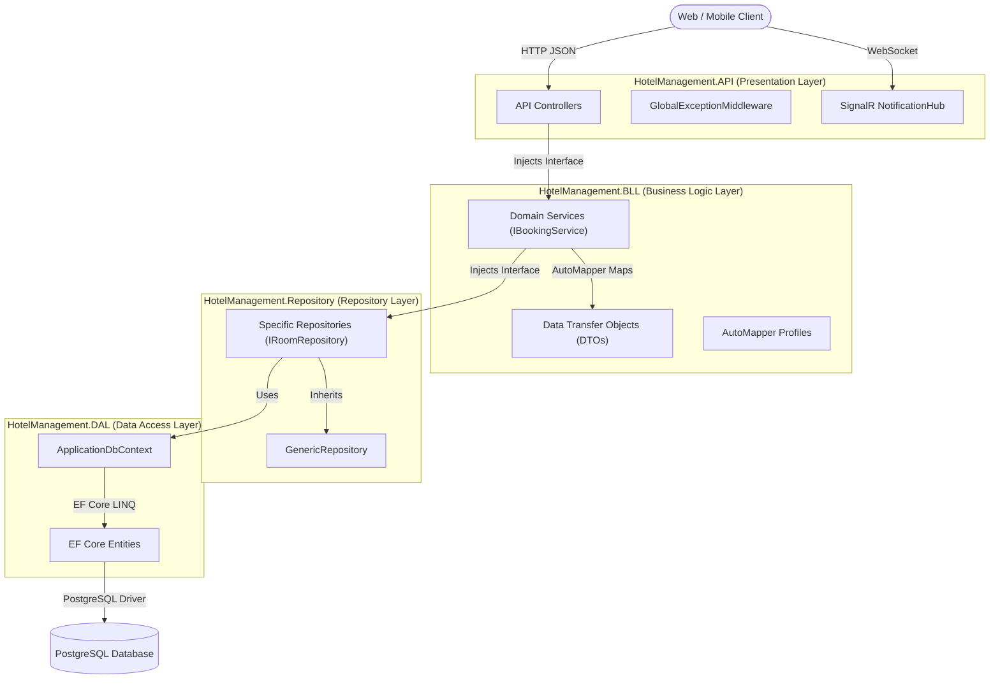
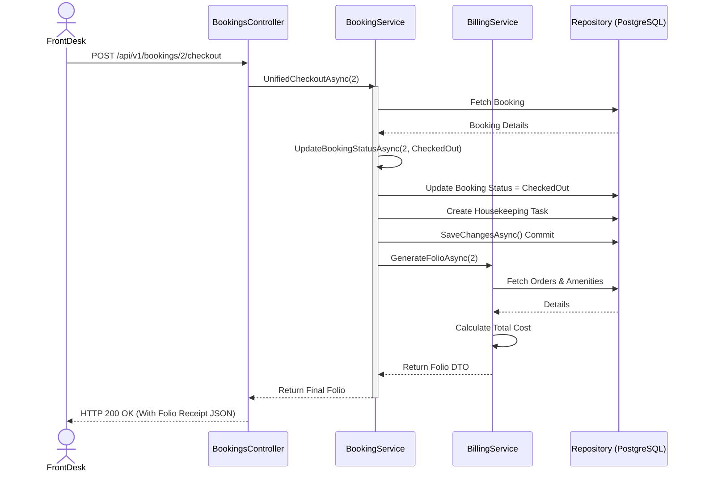
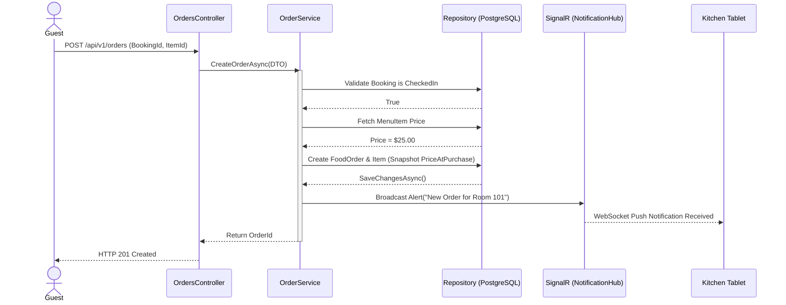

# Architecture and Flow

## 1. Executive Summary
The Hotel Management System backend is a high-performance monolithic Web API developed using **ASP.NET Core 10**. The system implements an **N-Tier Architecture** combined with **Domain-Driven Design (DDD)** principles to ensure a strict separation of concerns, high maintainability, and robust testability.

The architectural flow is unidirectional:
`Client` $\rightarrow$ `Presentation Layer (API)` $\rightarrow$ `Business Logic Layer (BLL)` $\rightarrow$ `Repository Layer` $\rightarrow$ `Data Access Layer (DAL)` $\rightarrow$ `PostgreSQL Database`.

---

## 2. N-Tier Architecture Breakdown

The solution is divided into distinct class libraries (layers) to enforce separation of concerns, orchestrated entirely via the Dependency Injection (DI) container in `HotelManagement.API/Program.cs`.

### 2.1 The Presentation Layer (`HotelManagement.API`)
**Responsibility:** Entry point for all client requests. Handles HTTP protocol concerns, request routing, and response formatting.

- **API Controllers:** Orchestrate requests by delegating business operations to BLL services. They handle HTTP status codes and input validation via `ModelState`.
- **Middleware & Filters:**
    - `GlobalExceptionMiddleware`: Centralized error handling that maps internal exceptions (e.g., `KeyNotFoundException`) to appropriate RFC 7807 compliant HTTP responses.
    - `IdempotentAttribute`: Implements request idempotency using a custom header (`X-Idempotency-Key`) and a dedicated database table to prevent duplicate processing of critical operations (e.g., payments, bookings).
- **Real-time Communication:** `NotificationHub` (SignalR) manages WebSocket connections, grouping users by roles (e.g., `KitchenGroup`, `HousekeepingGroup`) for targeted real-time alerts.
- **Cross-Cutting Services:**
    - `CurrentUserService`: Extracts user identity and roles from the JWT claims provided by `HttpContext`.
    - `SignalRNotificationService`: Bridges BLL business events to the SignalR Hub for real-time notifications.

### 2.2 The Business Logic Layer (`HotelManagement.BLL`)
**Responsibility:** The "Brain" of the application. It implements domain rules, manages complex workflows, and enforces security boundaries.

- **Domain Services:** (e.g., `BookingService`, `BillingService`, `AnalyticsService`). These classes contain the core business logic. For example, `BookingService` manages overbooking prevention, room auto-assignment, and stay extensions.
- **Data Transfer Objects (DTOs):** Strictly defined contracts for data exchange. BLL ensures that internal database entities are never exposed to the API layer, preventing data leakage.
- **AutoMapper Profiles:** Centrally managed mapping configurations (`MappingProfile`) that handle the transformation between Entities and DTOs.
- **Interfaces:** All services are abstracted via interfaces (e.g., `IBookingService`) to support Dependency Injection and facilitate unit testing via mocking.

### 2.3 The Repository Layer (`HotelManagement.Repository`)
**Responsibility:** Abstracts the data persistence mechanism, shielding the BLL from the specifics of Entity Framework Core.

- **Generic Repository:** `GenericRepository<T>` provides standardized CRUD operations (`GetAllAsync`, `GetByIdAsync`, `AddAsync`, etc.) to reduce boilerplate code.
- **Specific Repositories:** (e.g., `BookingRepository`, `RoomRepository`). These extend the generic repository to implement complex queries, such as `GetAvailableRoomTypesAsync` which calculates room availability across date ranges.
- **Analytics Repository:** A specialized repository focused on read-heavy aggregates and the execution of **PostgreSQL Stored Procedures** (e.g., `calculaterevpar`, `calculateoccupancyrate`) for high-performance reporting.
- **Pagination:** Implements a standardized `PaginatedResult<T>` model to ensure consistent API pagination across all endpoints.

### 2.4 The Data Access Layer (`HotelManagement.DAL`)
**Responsibility:** Defines the physical schema and database interaction logic.

- **ApplicationDbContext:** The EF Core gateway. It configures table relationships, defines column types (e.g., `decimal(18,2)` for financial data), and handles the mapping of Enums to strings in PostgreSQL.
- **Entities:** POCO classes representing database tables. Notable implementations include:
    - **Concurrency Control:** `Booking` and `Room` entities use `[Timestamp]` (`RowVersion`) to prevent lost updates during concurrent modifications.
    - **Soft Deletes:** Implementation of `IsActive` flags across `User`, `Room`, and `RoomType` to preserve historical data.
- **Automated Auditing:** The `ApplicationDbContext` overrides `SaveChangesAsync` to automatically intercept changes. It uses an `AuditEntryHelper` to capture `OldValues` and `NewValues` and persists them into the `AuditLogs` table as `jsonb` data.

---

## 3. Security Architecture & Identity Barrier

### 3.1 Stateless JWT Authentication
The API utilizes JSON Web Tokens (JWT) for stateless identity verification.
1. **Issuance:** `AuthService` validates credentials using **BCrypt** for password hashing and issues a signed HMAC-SHA256 token.
2. **Verification:** The `JwtBearer` middleware in `Program.cs` validates the token's signature and expiration on every request.
3. **Identity Propagation:** User details (Email, Role, Name) are embedded in the token claims and accessed via `ICurrentUserService`.

### 3.2 The BLL Authorization Barrier
While the API controllers use standard `[Authorize(Roles="Admin")]` attributes, the BLL implements an internal "Barrier Pattern" to prevent data leakage at the code level.
- The `HotelManagement.API.Services.CurrentUserService` is injected into the BLL as `ICurrentUserService`. 
- When a service is called (e.g., `GetBookingsAsync`), the service checks `_currentUserService.IsInRole("RegisteredUser")`.
- If true, the service dynamically injects a filter (e.g., `WHERE UserId = {CurrentUserId}`) into the Repository query to ensure users only see their own data.

---

## 4. Global Exception Handling Flow

To maintain pristine API responses and prevent leaking internal stack traces, a custom `GlobalExceptionMiddleware` wraps the entire HTTP pipeline.

### The Flow:
1. An endpoint is struck, and the Controller calls a Service.
2. The Service detects a failure (e.g., fetching a missing Booking) and throws an exception.
3. The Controller fails to catch it, bubbling up the pipeline.
4. The `GlobalExceptionMiddleware` intercepts the exception.
5. The Middleware evaluates the Exception Type:
   - `ArgumentException` / `InvalidOperationException` $\rightarrow$ `400 Bad Request`
   - `UnauthorizedAccessException` $\rightarrow$ `401 Unauthorized`
   - `KeyNotFoundException` $\rightarrow$ `404 Not Found`
   - Any other unknown exception $\rightarrow$ `500 Internal Server Error`

---

## 5. Key Technical Implementations

### 5.1 Data Consistency & Integrity
- **Idempotency:** The `IdempotentAttribute` ensures that if a client retries a `POST` request (due to network timeout), the system will not create duplicate bookings or charge a customer twice.
- **Transaction Management:** Business operations are wrapped in `SaveChangesAsync()` calls within the BLL to ensure atomic updates.
- **Custom Model Binding:** `CustomDateTimeModelBinder` ensures a consistent `dd-MM-yyyy` date format across all API inputs, regardless of server locale.

### 5.2 Real-time Notification Pipeline
When a business event occurs (e.g., `BookingService.UpdateBookingStatusAsync` marks a room as `CheckedOut`):
1. The BLL calls `INotificationService.SendHousekeepingAlertAsync()`.
2. The `SignalRNotificationService` broadcasts a message to the `HousekeepingGroup`.
3. Connected staff tablets receive the alert instantly via WebSockets.

---

## 6. Workflow Sequence Diagrams

### 6.1 The Unified Checkout Workflow

### 6.2 Room Service & Kitchen Notification Workflow

---

## 7. Infrastructure & Pipeline

### 7.1 Dependency Injection (DI)
The entire application is wired in `Program.cs` using a `Scoped` lifetime for repositories and services, ensuring a single `ApplicationDbContext` per HTTP request.

### 7.2 Rate Limiting
A `FixedWindowLimiter` is applied globally via `Program.cs`, restricting requests to 100 per 10 seconds to protect the API from denial-of-service (DoS) attacks and brute-force attempts.