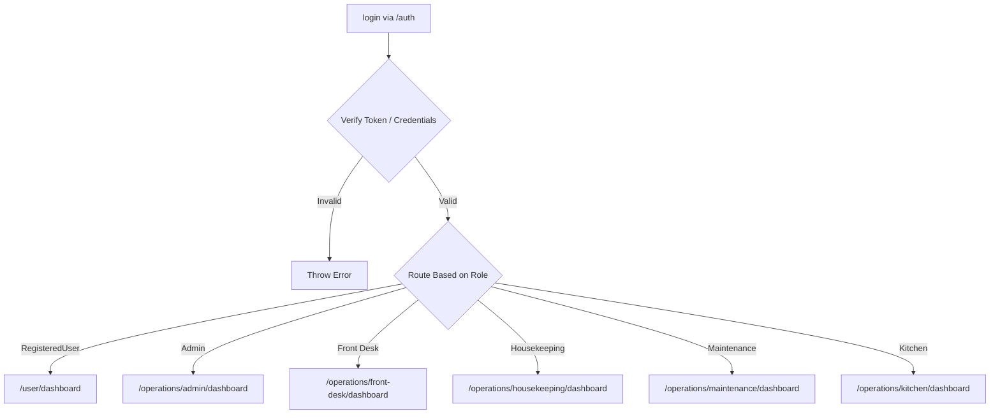
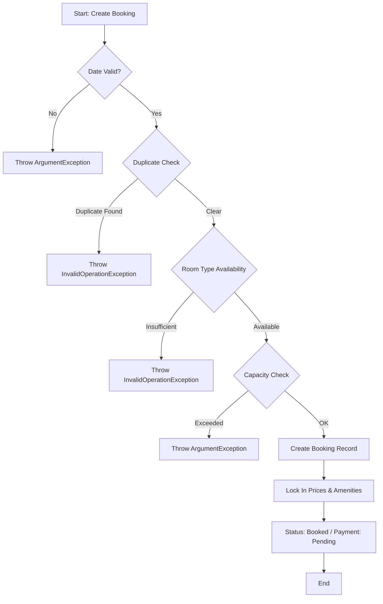
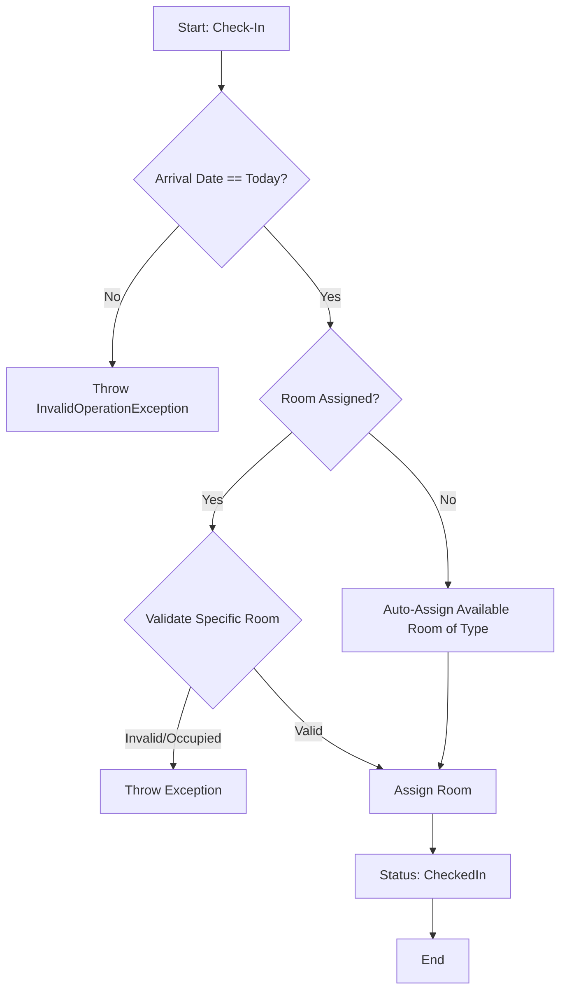
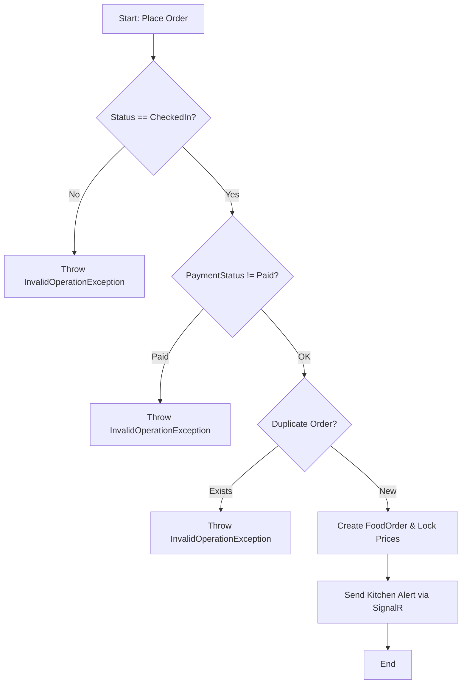
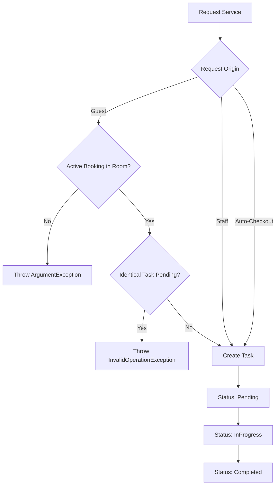
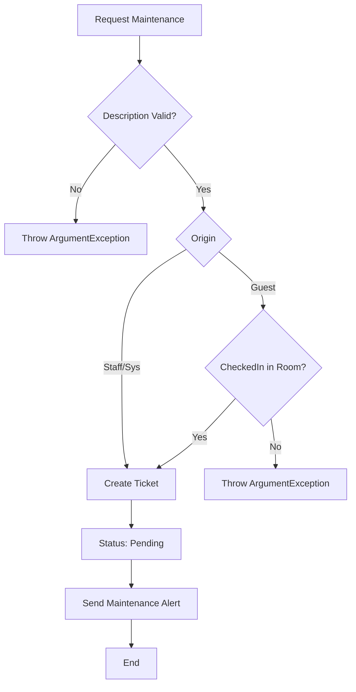
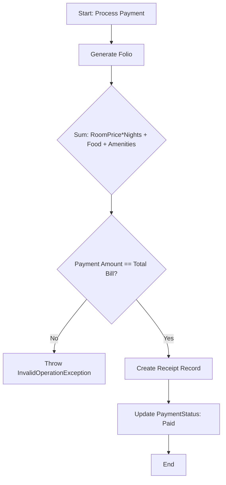
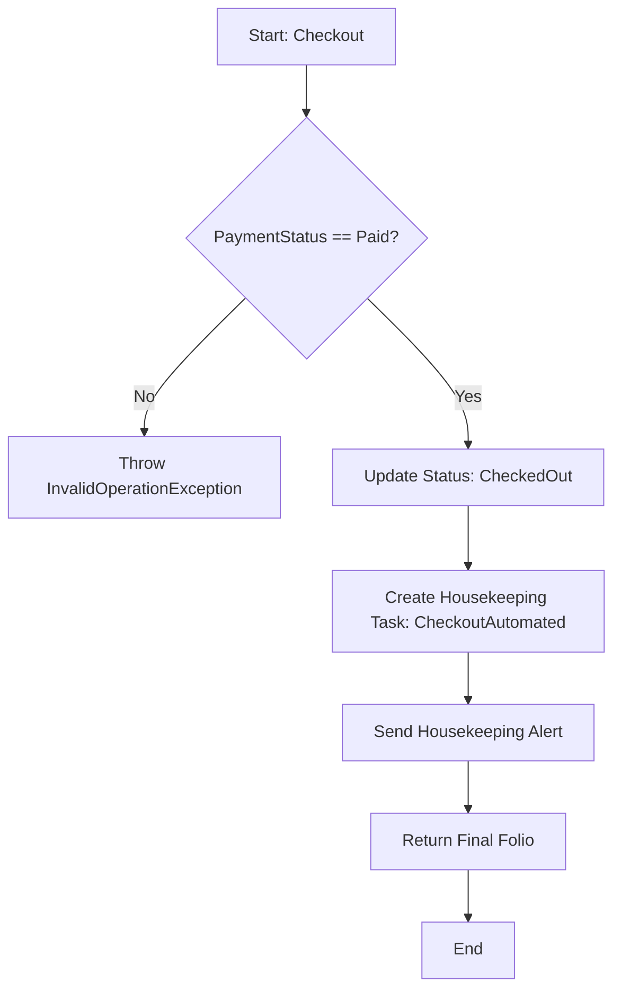
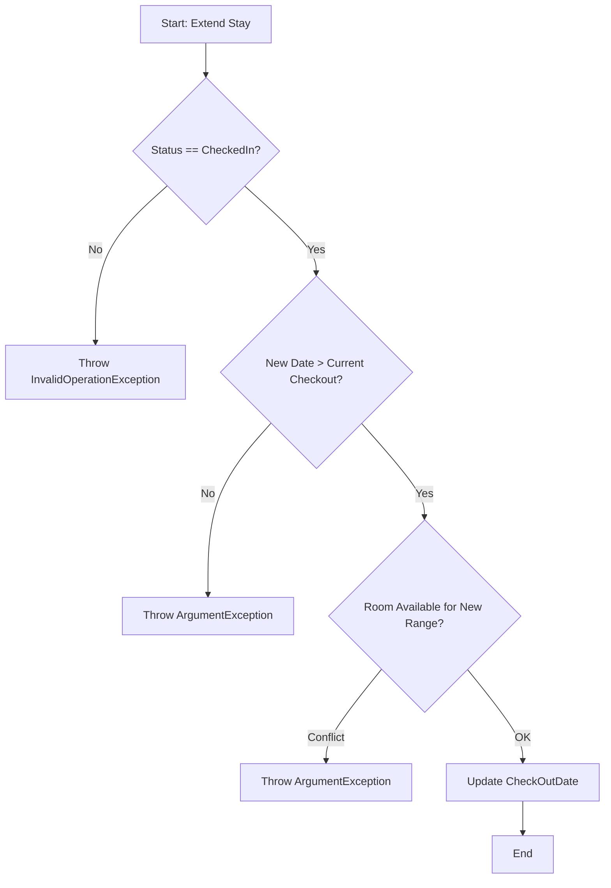

# Hotel Management System - Business Flow

This document outlines the business processes and operational flows as implemented in the application code.

## 0. Auth Flow

- Single login system for both Customer + Operations
- JWT authentication
- After login:
  - CUSTOMER → /customer
  - OPERATIONS → /operations/{respective-role}

## 1. Reservation & Booking Flow
**Entry Point:** `BookingService.CreateBookingAsync`

- **Validation**: 
    - Ensures check-in dates are not in the past and check-out is after check-in.
    - Prevents duplicate bookings from the same email within a 1-minute window.
- **Availability Check**:
    - Verifies that the requested number of rooms for each `RoomType` are available for the selected date range to prevent overbooking.
    - Validates that the total occupancy capacity of selected rooms accommodates the guest count.
- **Booking Creation**:
    - Handles both `RegisteredUser` and `Guest` origins.
    - Locks in the `BasePrice` of the room type at the time of booking.
    - Associates optional amenities with their prices at the time of purchase.
    - Sets initial status to `Booked` and payment to `Pending`.

## 2. Check-In Flow
**Entry Point:** `BookingService.CheckInGuestAsync`

- **Arrival Validation**: Guests can only check in on their scheduled arrival date.
- **Room Assignment**:
    - If a room was not pre-assigned, the system automatically assigns an available room of the correct type that is not occupied by another active booking.
    - If a room was pre-assigned, it validates that the room is active and matches the booked type.
- **Status Update**: The booking status is transitioned from `Booked` to `CheckedIn`.

## 3. Guest Stay Operations

### 3.1 Room Service & Dining
**Entry Point:** `OrderService.CreateOrderAsync`

- **Eligibility**: Only guests with a `CheckedIn` status can place food orders.
- **Price Locking**: MenuItem prices are captured at the moment of the order to ensure billing consistency.
- **Notifications**: Triggers a kitchen alert via `INotificationService` upon order placement.

### 3.2 Housekeeping Services
**Entry Point:** `HousekeepingService`

- **Guest Requests**: Checked-in guests can request cleaning/services for their assigned room.
- **Internal Requests**: Staff can create housekeeping tasks for any location.
- **Workflow**: Tasks move through `Pending` $\rightarrow$ `InProgress` $\rightarrow$ `Completed`.

### 3.3 Room Maintenance
**Entry Point:** `MaintenanceService`

- **Ticket Creation**: Guests (if checked in) or staff can create maintenance tickets.
- **Validation**: Descriptions must contain at least one alphabet character to prevent empty/symbol-only tickets.
- **Notifications**: Triggers maintenance alerts for the engineering team.

## 4. Billing & Settlement Flow
**Entry Point:** `BillingService`

- **Folio Generation**:
    - Calculates total cost: `(Room Base Price * Number of Nights) + Σ(Food Order Items) + Σ(Booking Amenities)`.
    - Handles refunded status for cancelled bookings that were previously paid.
- **Payment Processing**:
    - Validates that the payment amount exactly matches the total bill.
    - Generates a `Receipt` record upon successful payment.
    - Updates `PaymentStatus` to `Paid`.

## 5. Checkout Flow
**Entry Point:** `BookingService.UnifiedCheckoutAsync`

- **Payment Verification**: Checkout is strictly forbidden unless the `PaymentStatus` is `Paid`.
- **Process**:
    - Updates booking status to `CheckedOut`.
    - **Automated Trigger**: Automatically creates a `Housekeeping` task with `CheckoutAutomated` origin to prepare the room for the next guest.
    - **Notification**: Sends a housekeeping alert that the room is ready for cleaning.
    - **Finalization**: Returns the final billing folio to the guest.

## 6. Stay Extension
**Entry Point:** `BookingService.ExtendStayAsync`

- **Eligibility**: Only guests currently `CheckedIn` can extend.
- **Conflict Check**: Verifies that the room is not reserved by another guest for the extension period.
- **Update**: Updates the `CheckOutDate` and saves the booking.