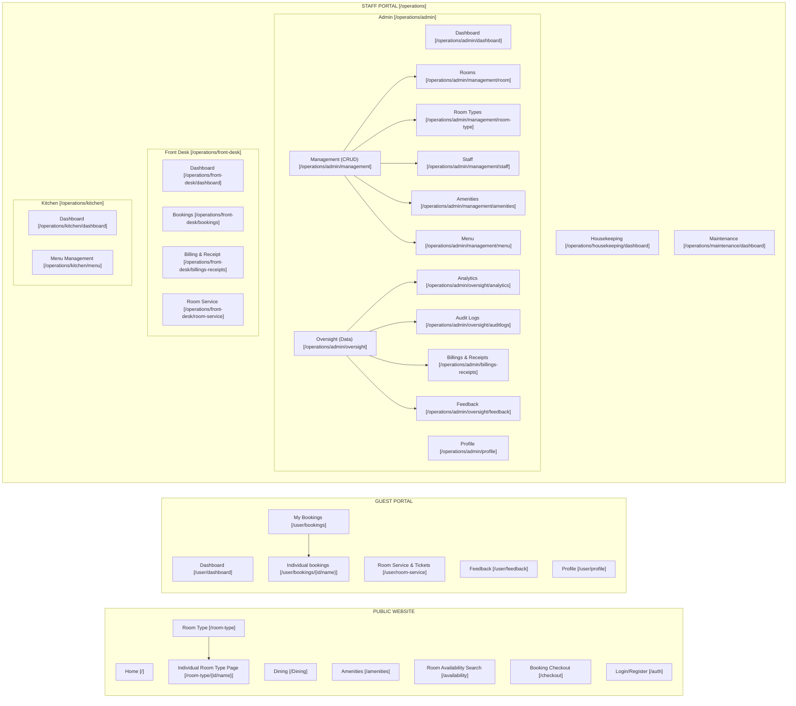

# Page Routing for Front End

```mermaid
graph LR
    subgraph PUBLIC_WEBSITE ["PUBLIC WEBSITE"]
        P_Home["Home [/]"]
        P_RoomType["Room Type [/room-type]"]
        P_RoomDetail["Individual Room Type Page [/room-type/{id/name}]"]
        P_Dining["Dining [/Dining]"]
        P_Amenities["Amenities [/amenities]"]
        P_Search["Room Availability Search [/availability]"]
        P_Checkout["Booking Checkout [/checkout]"]
        P_Auth["Login/Register [/auth]"]
    end

    subgraph GUEST_PORTAL ["GUEST PORTAL"]
        G_Dash["Dashboard [/user/dashboard]"]
        G_Bookings["My Bookings [/user/bookings]"]
        G_BookingDetail["Individual bookings [/user/bookings/{id/name}]"]
        G_Service["Room Service & Tickets [/user/room-service]"]
        G_Feedback["Feedback [/user/feedback]"]
        G_Profile["Profile [/user/profile]"]
    end

    subgraph STAFF_PORTAL ["STAFF PORTAL [/operations]"]
        subgraph Admin ["Admin [/operations/admin]"]
            A_Dash["Dashboard [/operations/admin/dashboard]"]
            A_Mgmt["Management (CRUD) [/operations/admin/management]"]
            A_Rooms["Rooms [/operations/admin/management/room]"]
            A_RoomTypes["Room Types [/operations/admin/management/room-type]"]
            A_Staff["Staff [/operations/admin/management/staff]"]
            A_Amenities["Amenities [/operations/admin/management/amenities]"]
            A_Menu["Menu [/operations/admin/management/menu]"]
            A_Oversight["Oversight (Data) [/operations/admin/oversight]"]
            A_Analytics["Analytics [/operations/admin/oversight/analytics]"]
            A_Audit["Audit Logs [/operations/admin/oversight/auditlogs]"]
            A_Billings["Billings & Receipts [/operations/admin/billings-receipts]"]
            A_Feedbacks["Feedback [/operations/admin/oversight/feedback]"]
            A_Profile["Profile [/operations/admin/profile]"]
        end
        
        subgraph FrontDesk ["Front Desk [/operations/front-desk]"]
            FD_Dash["Dashboard [/operations/front-desk/dashboard]"]
            FD_Bookings["Bookings [/operations/front-desk/bookings]"]
            FD_Bill["Billing & Receipt [/operations/front-desk/billings-receipts]"]
            FD_Service["Room Service [/operations/front-desk/room-service]"]
        end

        HK_Dash["Housekeeping [/operations/housekeeping/dashboard]"]
        MNT_Dash["Maintenance [/operations/maintenance/dashboard]"]
        
        subgraph Kitchen ["Kitchen [/operations/kitchen]"]
            K_Dash["Dashboard [/operations/kitchen/dashboard]"]
            K_Menu["Menu Management [/operations/kitchen/menu]"]
        end
    end

    %% Relationships
    P_RoomType --> P_RoomDetail
    G_Bookings --> G_BookingDetail
    A_Mgmt --> A_Rooms
    A_Mgmt --> A_RoomTypes
    A_Mgmt --> A_Staff
    A_Mgmt --> A_Amenities
    A_Mgmt --> A_Menu
    A_Oversight --> A_Analytics
    A_Oversight --> A_Audit
    A_Oversight --> A_Billings
    A_Oversight --> A_Feedbacks
```