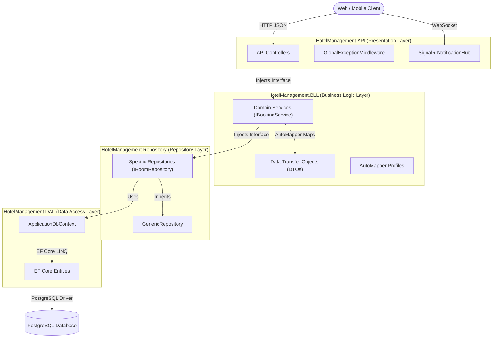

# Architecture and Flow

## 1. Executive Summary
The Hotel Management System backend is a high-performance monolithic Web API developed using **ASP.NET Core 10**. The system implements an **N-Tier Architecture** combined with **Domain-Driven Design (DDD)** principles to ensure a strict separation of concerns, high maintainability, and robust testability.

The architectural flow is unidirectional:
`Client` → `Presentation Layer (API)` → `Business Logic Layer (BLL)` → `Repository Layer` → `Data Access Layer (DAL)` → `PostgreSQL Database`.

---

## 2. N-Tier Architecture Breakdown

The solution is divided into distinct class libraries (layers) to enforce separation of concerns, orchestrated entirely via the Dependency Injection (DI) container in `HotelManagement.API/Program.cs`.

---

*This document will be continuously enriched with detailed code references, line numbers, and additional diagrams as we parse each backend source file.*
