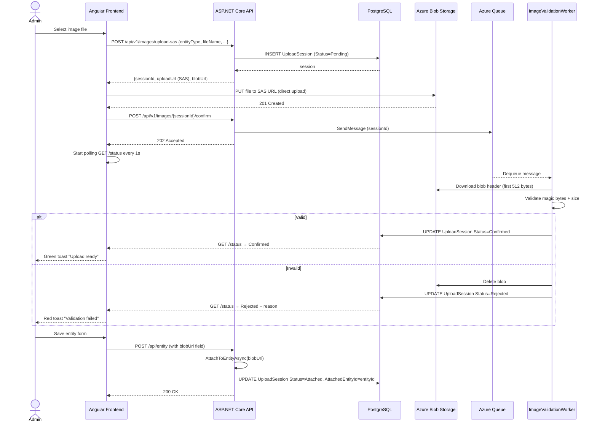
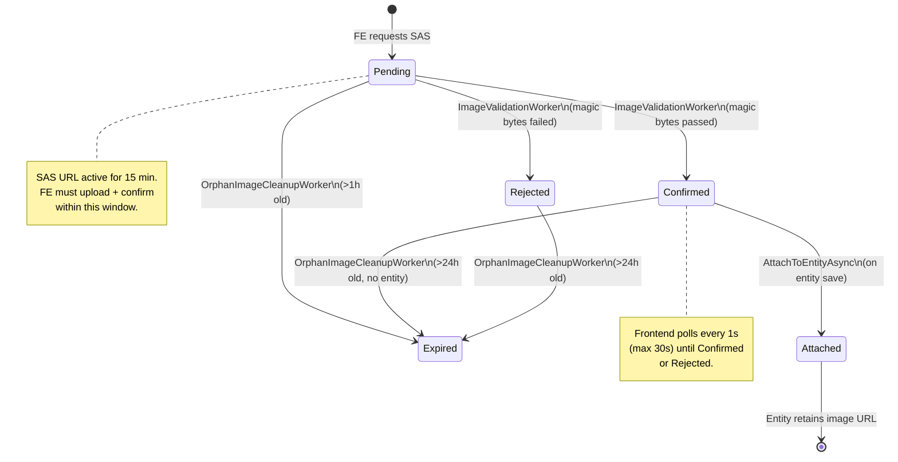
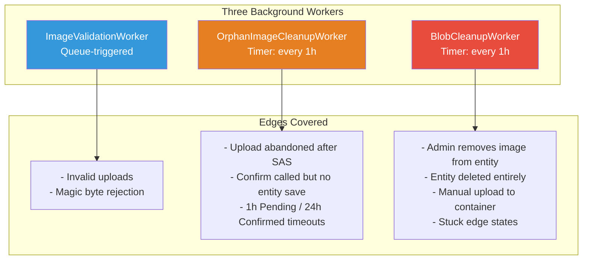
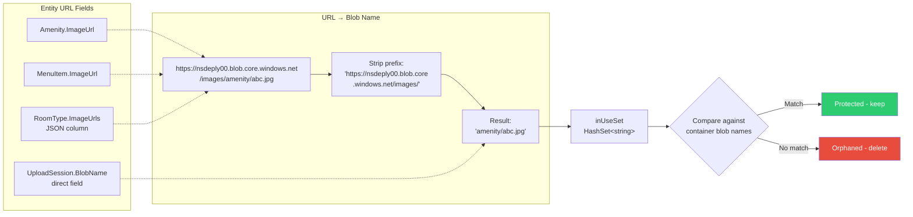

# Blob Image Upload Feature

## Overview

A serverless-image upload pipeline that lets admin users upload images directly to Azure Blob Storage from the browser without exposing storage credentials to the frontend. The system uses [[Service SAS tokens]] for secure, time-limited upload access and handles every stage of the image lifecycle — from upload and validation to orphan cleanup.

---

## Architecture

```
┌──────────────┐     SAS URL      ┌──────────────────┐
│  Angular FE  │ ──────────────── │  Azure Blob      │
│  (SAS Link)  │   Direct PUT     │  Storage (images)│
└──────┬───────┘                  └────────┬─────────┘
       │                                  │
       │  POST /upload-sas         Queue Message
       │  POST /confirm            (async)
       │  GET  /status             │
       ▼                          ▼
┌──────────────────┐     ┌──────────────────────────┐
│  ImagesController │     │  ImageValidationWorker   │
│  (ASP.NET Core)   │     │  (magic bytes check)     │
│                   │     │                          │
│  ImageUploadService│    │  OrphanImageCleanupWorker│
│  BlobCleanupWorker │     │  BlobCleanupWorker       │
└──────────────────┘     └──────────────────────────┘
```

### Key Components

| Component | Location | Purpose |
|-----------|----------|---------|
| `ImagesController` | `API/Controllers/ImagesController.cs` | REST endpoints for upload lifecycle |
| `ImageUploadService` | `BLL/Services/ImageUploadService.cs` | SAS generation, session management, entity attachment |
| `ImageValidationWorker` | `BLL/Workers/ImageValidationWorker.cs` | Async magic byte validation via Azure Queue |
| `OrphanImageCleanupWorker` | `BLL/Workers/OrphanImageCleanupWorker.cs` | Cleans stale Pending/Confirmed sessions |
| `BlobCleanupWorker` | `BLL/Workers/BlobCleanupWorker.cs` | Cross-references UploadSessions + entity URL fields to delete orphaned blobs |
| `ImageUploadOrUrlComponent` | `Frontend/.../image-upload-or-url/` | UI component for upload or URL input |
| `ImageApiService` | `Frontend/.../image-api.service.ts` | HTTP client for images API |
| `AzureCredentialFactory` | `API/Utilities/AzureCredentialFactory.cs` | Creates blob/queue clients via StorageSharedKeyCredential |

---

## Upload Flow (End-to-End)

### Step 1: Frontend Requests Upload SAS

```
POST /api/v1/images/upload-sas
Authorization: Bearer <JWT>
Body: { entityType, fileName, contentType, sizeBytes }
```

Backend creates an `UploadSession` (`Status: Pending`), validates extension and size against configured limits, then generates a [[Service SAS token]] with **Write + Create** permissions only (no Read, List, or Delete). The SAS URL is returned to the frontend.

```json
Response 200:
{
  "sessionId": "uuid",
  "uploadUrl": "https://nsdeply00.blob.core.windows.net/images/amenity/uuid.jpg?sv=...&sig=...",
  "blobUrl": "https://nsdeply00.blob.core.windows.net/images/amenity/uuid.jpg",
  "expiresOn": "2026-07-10T..."
}
```

### Step 2: Frontend Uploads Directly to Azure

The browser PUTs the file directly to the SAS URL with `x-ms-blob-type: BlockBlob`. No credentials are sent — only the SAS token in the URL query string. The file never passes through the backend.

### Step 3: Frontend Confirms Upload

```
POST /api/v1/images/{sessionId}/confirm
```

Backend sends a message to the Azure Queue (`image-validation-queue`) and returns `202 Accepted`.

### Step 4: Backend Validates Asynchronously

`ImageValidationWorker` picks up the queue message and:

1. Downloads the first **512 bytes** of the blob
2. Checks **magic bytes** (file signatures) against the declared extension:

| Extension | Magic Bytes |
|-----------|-------------|
| `.jpg` / `.jpeg` | `0xFF 0xD8 0xFF` |
| `.png` | `0x89 0x50 0x4E 0x47 0x0D 0x0A 0x1A 0x0A` |
| `.webp` | `0x52 0x49 0x46 0x46` + `0x57 0x45 0x42 0x50` at offset 8 |

3. Validates actual file size against the max limit
4. If valid → session status changes to `Confirmed`
5. If invalid → session changes to `Rejected`, blob is deleted from storage

### Step 5: Frontend Polls for Status

After confirming, the frontend polls every 1 second (max 30 seconds):

```
GET /api/v1/images/{sessionId}/status
```

- `Confirmed` → green success toast, URL emitted to form
- `Rejected` → red error toast with `rejectionReason`
- Timeout → red toast "Upload validation timed out"

### Step 6: Entity Save Attaches the Session

When the admin saves the entity (Amenity/MenuItem/RoomType), the service calls `AttachToEntityAsync()`, which:

1. Looks up the `UploadSession` by blob URL
2. Verifies ownership (email match)
3. Confirms status is `Confirmed` or `Attached`
4. Sets `Status = Attached` and `AttachedEntityId = entityId`

The session creation, attachment, and entity save all happen within a single transaction — if anything fails, everything rolls back.

---

## Security Features

### SAS Token Hardening

- **Permissions**: `Write | Create` only — no Read, List, or Delete
- **Resource**: Blob-level (`b`), not container-level
- **Expiry**: Configurable via `AzureStorageOptions.SasExpiryMinutes` (default 15 min)
- **Start time**: -5 minutes (clock skew tolerance)
- **Scope**: Single blob path, not the entire container

```
sv=2026-06-06&se=2026-07-10T15:30:00Z&sr=b&sp=cw&sig=...
                              ^              ^  ^
                          expires 15m    blob   create+write
```

### Magic Byte Validation

File extension checking alone is trivially bypassed. This system reads the actual binary content of the uploaded file and validates its file signature against the declared format. This prevents:

- Renaming a `.exe` to `.jpg` to bypass extension checks
- Uploading HTML/scripts with image extensions (XSS vectors)
- Corrupted or mismatched file content

### Server-Side Double-Check

Even though the frontend declares `sizeBytes` and `contentType`, the backend:

1. Validates declared size before generating SAS
2. Validates actual blob size after upload
3. Both checks use the same configured `MaxSizeBytes` limit

### Session Ownership

Every `UploadSession` is linked to an email (`UploadedByEmail`). Operations enforce ownership:
- Only the uploader can confirm a session
- Only the uploader can attach a session to an entity
- Only the uploader can check session status

### Rate Limiting

```
ImageUpload policy: 20 requests per 5 minutes
```

Applied to the `POST /upload-sas` endpoint to prevent abuse.

### Extension Whitelist

Only `.jpg`, `.jpeg`, `.png`, `.webp` are allowed — configured via `AzureStorageOptions.AllowedExtensions`.

---

## Background Workers

### 1. ImageValidationWorker

| Aspect | Detail |
|--------|--------|
| Queue | `image-validation-queue` (Azure Queue) |
| Trigger | Message pushed by `ConfirmUploadAsync` |
| Action | Downloads first 512 bytes, validates magic bytes, checks size |
| Success | Status → `Confirmed`, `ActualSizeBytes` set, `ConfirmedAtUtc` set |
| Failure | Status → `Rejected`, `RejectionReason` set, blob deleted |

### 2. OrphanImageCleanupWorker

| Aspect | Detail |
|--------|--------|
| Interval | Every 1 hour |
| Scope | Cleans stale `Pending` sessions (>1h old) and orphaned `Confirmed`/`Rejected` sessions (>24h old, no entity) |
| Action | Sets `Status = Expired`, deletes blob from storage |

### 3. BlobCleanupWorker

| Aspect | Detail |
|--------|--------|
| Interval | Every 1 hour (runs immediately on startup) |
| Scope | Cross-references blob container against UploadSessions + entity URL fields |
| Action | Deletes blobs whose names don't match any in-use URL across all sources |

**Cross-reference sources for in-use blob detection:**

```
1. UploadSession.BlobName    → Pending / Confirmed / Attached sessions
2. Amenity.ImageUrl          → blob name extracted from full URL
3. MenuItem.ImageUrl         → blob name extracted from full URL
4. RoomType.ImageUrls        → blob names extracted from JSON column (loaded in memory)
```

Blob names are extracted by stripping the storage prefix (`{AccountUrl}/{ContainerName}/`) from entity URL fields. This ensures that blobs referenced by entity data are protected even after their `UploadSession` is fully resolved.

This worker handles edge cases the other workers miss:
- Admin removes image URL from entity in admin portal → old blob no longer in entity fields → swept
- Entity is deleted entirely → its attached images are no longer in any source → swept
- Blobs uploaded manually to the container (no session) → swept
- Sessions stuck in edge states → swept

---

## Frontend Architecture

### ImageUploadOrUrlComponent

A standalone Angular component providing two upload paths:

```
┌─ Upload Area ─────────────────────────┐
│ [Choose Image]    ○ (spinner)         │
│ Uploading... / Validating...          │
├─ or ──────────────────────────────────┤
│ [Image URL: ____________________ ] ✕  │
├─ Preview ─────────────────────────────┤
│       ┌──────────────────┐            │
│       │    image.jpg      │            │
│       └──────────────────┘            │
└───────────────────────────────────────┘
```

**Upload flow within the component:**

```
Choose Image
  → isUploading=true, uploadPhase='uploading'
  → POST /upload-sas
    → PUT to SAS URL (Azure direct)
      → uploadPhase='validating'
      → POST /confirm (202 Accepted)
        → poll GET /status every 1s (max 30s)
          → Confirmed: green toast, emit blobUrl
          → Rejected: red toast with reason, clear
          → Timeout: red toast "timed out"
```

### Status Polling

After the 202 Accepted from confirm, the frontend polls status rather than immediately emitting the URL. This ensures:

- Entity save won't fail with "not confirmed" error
- User sees a clear "Validating..." state during processing
- Rejected uploads show a friendly error message instead of a broken save

### Themed Toasts

| Status | Style | Position |
|--------|-------|----------|
| Success | Green left border, glass background | Top-right |
| Error | Red left border, glass background | Top-right |

Matches the app's dark glassmorphism theme — consistent with `NotificationSnackbarComponent`.

---

## API Contract

### POST /api/v1/images/upload-sas

Request:
```json
{
  "entityType": "Amenity | MenuItem | RoomType",
  "fileName": "photo.jpg",
  "contentType": "image/jpeg",
  "sizeBytes": 5242880,
  "entityId": null
}
```

Response `200`:
```json
{
  "sessionId": "guid",
  "uploadUrl": "https://...?sig=...",
  "blobUrl": "https://.../photo.jpg",
  "expiresOn": "2026-07-10T..."
}
```

### POST /api/v1/images/{sessionId}/confirm

Response `202`:
```json
{
  "message": "Upload confirmed, validation queued."
}
```

### GET /api/v1/images/{sessionId}/status

Response `200`:
```json
{
  "status": "Pending | Confirmed | Rejected",
  "rejectionReason": null
}
```

---

## What Makes This Feature Special

### 1. True Decoupling

Upload flow is completely independent of entity CRUD. The user can upload images at any time — before, during, or after filling out the form. The system only links them when the entity is saved.

### 2. No Credentials on the Client

The frontend never sees the storage account key. SAS tokens are scoped to a single blob with minimum permissions. Even if intercepted, they expire in 15 minutes and can only write one file.

### 3. Direct-to-Azure Upload

Files bypass the backend entirely during upload. No memory or bandwidth consumed by the server for large image transfers. The backend only handles small API calls (SAS requests, confirmations, status checks).

### 4. Magic Byte Validation Over Extension Checking

Many systems check file extensions only — trivial to bypass. This system reads the file header and validates against known binary signatures, making it resistant to extension spoofing.

### 5. Queue-Based Async Validation

Validation is decoupled from the HTTP request lifecycle. The user gets an immediate `202 Accepted` and the system processes validation reliably via Azure Queue with automatic retries and error handling.

### 6. Multi-Tier Cleanup

Three layers prevent blob sprawl:
- `ImageValidationWorker` — deletes immediately on validation failure
- `OrphanImageCleanupWorker` — handles stale/incomplete sessions (timeout-based)
- `BlobCleanupWorker` — cross-references all entity URL fields + active sessions against container contents; catch-all for any blob not in active use

The `BlobCleanupWorker` is the only layer that accounts for **entity state changes** — if an admin removes or replaces an image URL on an Amenity, MenuItem, or RoomType, the old blob is swept on the next run even though its `UploadSession` may still be `Attached`.

### 7. Known Edge Cases & Minor Findings

The following non-blocking findings were identified during verification review. All are acceptable given the existing cleanup architecture.

| ID | Area | Finding | Risk | Mitigation |
|----|------|---------|------|------------|
| `ORDER-01` | `ImageValidationWorker.RejectSession` | DB save (`Status = Rejected`) executes before blob delete. If the blob delete fails, the session is marked Rejected but the blob remains in storage. | Low — orphan blob persists until next cleanup cycle | `BlobCleanupWorker` catches orphaned blobs hourly and deletes them. |
| `MISSING-RETRY-01` | `OrphanImageCleanupWorker` | Blob deletion has no retry logic. If a transient Azure error occurs, the expired session stays expired but the blob persists. | Low — blob remains until next cleanup cycle | `BlobCleanupWorker` independently sweeps blobs not referenced by any entity, covering this gap. |
| `RACE-01` | `BlobCleanupWorker` | Window between building `activeBlobNames` (from entity fields + sessions) and marking matching sessions as `Expired`. A session could transition to `Attached` during this window. | Very Low — window is seconds within a 1-hour cycle | In practice, a user would need to save an entity at the exact moment the worker is processing the corresponding blob. `BlobCleanupWorker` re-runs hourly and corrects state. |
| `FRAGILE-01` | Frontend `image-upload-or-url.component.ts` | `detectEntityType()` infers entity type from `window.location.pathname` rather than receiving it as an `@Input()`. Works correctly but fragile if route paths change. | Low — functional, not broken | Consider adding an explicit `@Input()` for entity type in future iteration. |

### 8. Frontend Resilience

- Polling ensures entities never save with unvalidated images
- Themed toasts give clear visual feedback at every stage
- Error messages are user-friendly, not raw API errors
- Both URL upload and file upload supported in the same component

### 9. TypeScript Type Safety

Full strick typing across all services, models, and component signals — no `any`, no implicit types, no non-null assertions.

---

## Visual Diagrams

### 1. End-to-End Upload Sequence



### 2. UploadSession State Machine



### 3. Background Workers Overview



### 4. BlobCleanupWorker Cross-Reference Flow

```mermaid
flowchart TD
    Start([Worker runs]) --> QuerySession[Query UploadSession<br/>WHERE Status IN<br/>(Pending, Confirmed, Attached)]
    QuerySession --> SessionNames[Add BlobName to inUseSet]

    SessionNames --> QueryAmenity[Query Amenity<br/>WHERE ImageUrl != null]
    QueryAmenity --> AmenityNames[Extract blob name<br/>from each URL → add to inUseSet]

    AmenityNames --> QueryMenuItem[Query MenuItem<br/>WHERE ImageUrl != null]
    QueryMenuItem --> MenuItemNames[Extract blob name<br/>from each URL → add to inUseSet]

    MenuItemNames --> QueryRoomType[Load RoomType entities<br/>WHERE ImageUrls != null]
    QueryRoomType --> RoomTypeNames[Parse JSON ImageUrls<br/>Extract blob names → add to inUseSet]

    RoomTypeNames --> ListBlobs[List all blobs<br/>in container]
    ListBlobs --> CheckBlob{Blob name<br/>in inUseSet?}

    CheckBlob -->|Yes| Skip[Skip - blob in use]
    CheckBlob -->|No| Delete[Delete blob]
    Delete --> MarkExpired{Has UploadSession?}
    MarkExpired -->|Yes| Expire[Mark session Expired]
    MarkExpired -->|No| Log[Log deletion]
    Log --> NextBlob
    Expire --> NextBlob[Next blob]
    NextBlob --> CheckBlob

    Skip --> NextBlob

    style Delete fill:#e74c3c,color:#fff
```

### 5. In-Use Blob Name Extraction



---

## Configuration (appsettings.Local.json)

```json
{
  "AzureStorage": {
    "AccountUrl": "https://nsdeply00.blob.core.windows.net",
    "ContainerName": "images",
    "QueueName": "image-validation-queue",
    "AccountKey": "***",
    "SasExpiryMinutes": 15,
    "MaxSizeBytes": 10485760,
    "MaxImagesPerRoomType": 5,
    "AllowedExtensions": [".jpg", ".jpeg", ".png", ".webp"]
  }
}
```

Storage account key stored only in `.gitignore`-d local config. Swap to `DefaultAzureCredential` + managed identity when deploying to Azure compute.

---

## Database Schema

```sql
CREATE TABLE "UploadSessions" (
    "Id" UUID PRIMARY KEY,
    "BlobName" TEXT NOT NULL,
    "BlobUrl" TEXT NOT NULL,
    "DeclaredContentType" TEXT NOT NULL,
    "DeclaredSizeBytes" BIGINT NOT NULL,
    "ActualSizeBytes" BIGINT NULL,
    "Status" INTEGER NOT NULL DEFAULT 0,  -- 0=Pending, 1=Confirmed, 2=Rejected, 3=Attached, 4=Expired
    "EntityType" INTEGER NOT NULL,         -- 0=Amenity, 1=MenuItem, 2=RoomType
    "AttachedEntityId" INTEGER NULL,
    "UploadedByEmail" TEXT NOT NULL,
    "CreatedAtUtc" TIMESTAMP NOT NULL,
    "ConfirmedAtUtc" TIMESTAMP NULL,
    "ExpiresAtUtc" TIMESTAMP NOT NULL,
    "RejectionReason" TEXT NULL
);
```

---

## Future Considerations

- **BlobCleanupWorker interval**: Currently runs every 1h, changeable via configuration
- **MaxImagesPerRoomType**: Enforced server-side before SAS generation
- **Synchronous validation alternative**: Could validate in `ConfirmUploadAsync` directly (sub-50ms check) to remove polling need
- **Image transformation**: Could add Azure Function to resize/optimize images on upload
- **CDN integration**: Azure Front Door or Verizon CDN could serve blob images with caching
