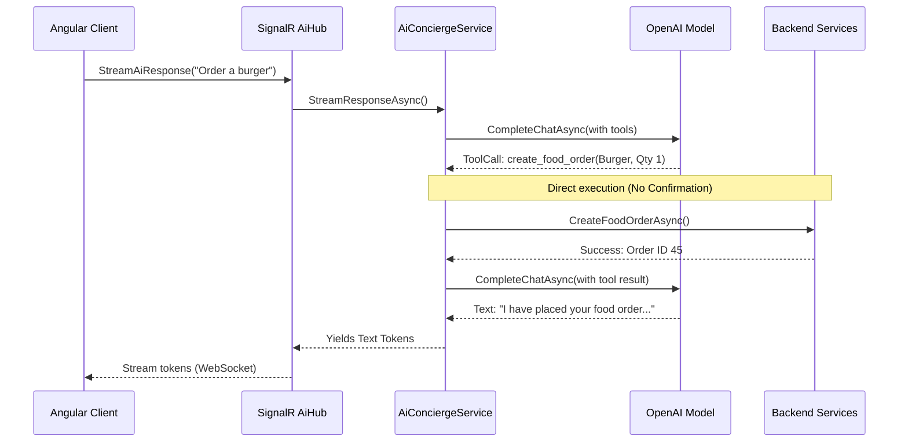
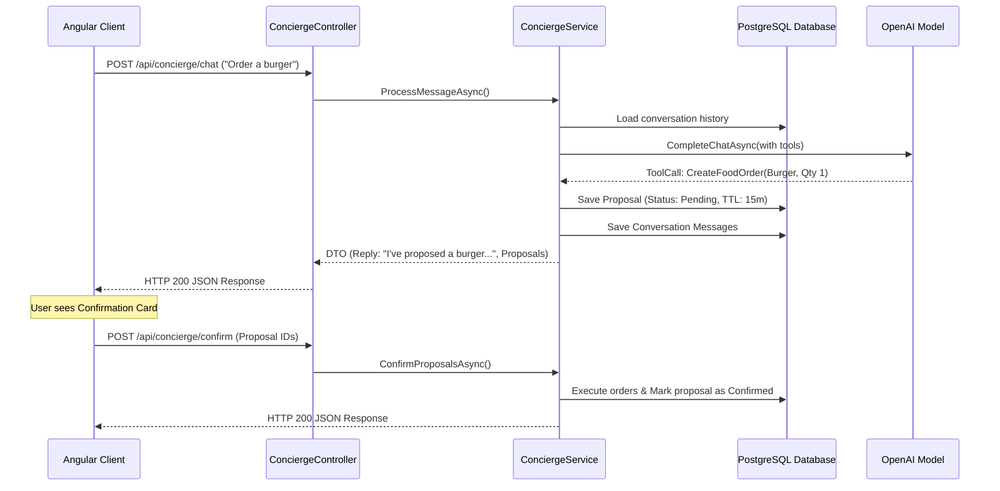

# AI Concierge Implementation Comparison: `feature/ai` vs. `feature/ai-2`

This document provides a comprehensive and detailed architectural comparison between the AI Concierge implementations in the `feature/ai` branch and the current `feature/ai-2` branch. It covers similar characteristics, key differences, in-depth analysis by topic, strengths and weaknesses, lessons learned, and a final verdict.

---

## 1. Similar Characteristics

Despite having vastly different architectural foundations, both branches share the same core functional objectives and use similar LLM integration patterns:

1. **Core LLM Platform & SDK**: Both implementations are written in C# on the backend and utilize the official `OpenAI` client libraries (`OpenAI.Chat` and `OpenAI` namespaces) to communicate with Chat Completion models.
2. **Context-Aware System Prompts**: Both systems dynamically inject guest context (retrieved from `ICurrentUserService` and `IBookingService`) into the LLM system prompt. This includes the guest's name, room assignment, booking status (e.g., Checked-In), and stay dates.
3. **Core Tool/Function Catalog**: Both systems define a similar set of tools exposed to the LLM via OpenAI function calling specs:
   - **Read-only tools**: `GetBookingInfo`, `GetFolioBalance`, `GetHousekeepingStatus`, `GetMenuItems`, `GetActiveOrders`.
   - **State-modifying/Side-effect tools**: `CreateFoodOrder` (room service), `CreateHousekeepingRequest`, `CreateMaintenanceTicket`.
4. **Behavioral Guardrails**: Both system prompts explicitly instruct the AI to limit replies to a concise length (under 3 sentences), warn guests about emergency maintenance/safety issues, detail food item prices before placing orders, and never expose database internal IDs (`bookingId`, `roomId`, `userId`) in the arguments.
5. **Authentication Barrier**: Both solutions require an authenticated JWT token on the frontend to communicate with the concierge service.

---

## 2. Table of Differences

| Feature Dimension | `feature/ai` Branch | `feature/ai-2` Branch |
| :--- | :--- | :--- |
| **Communication Protocol** | Real-time WebSockets via **SignalR** | Transactional HTTP requests via **REST API** |
| **Message Delivery** | **Streaming** (token-by-token) | **Single-payload** Request/Response |
| **Action Execution Flow** | **Immediate/Direct Execution** — The LLM calls a side-effect tool and the backend executes it immediately in the background without user intervention. | **Two-Step Proposal Pattern** — The LLM creates a `ConciergeProposal` (pending state) in the database. The user must review and explicitly confirm or dismiss it. |
| **Session & Chat History** | **In-memory** `ConcurrentDictionary` on the server. History is lost if the application restarts. | **PostgreSQL Persistent Store** (`ConversationMessage` table). Chat history is durable and per-user. |
| **State Modifying Records** | Volatile in memory. No persistent proposal objects. | **PostgreSQL Persistent Store** (`ConciergeProposal` table) with customizable expiration TTL. |
| **Action Auditing** | None. Actions are executed via BLL services directly without auditing logs. | **PostgreSQL Audit Log** (`ConciergeActionLog` table) records every tool execution, its inputs, success/fail status, and user details. |
| **Rate Limiting** | Uses standard global middleware (if any). No specific AI concierge limit. | **JWT-based Token Bucket rate limiting** (30 requests/minute per-user limit) configured at the endpoint level. |
| **Idempotency Checks** | None. Repeated WebSocket messages or retries could execute duplicate actions. | **Idempotency Key validation** (`IdempotentAttribute`) using EF Core to prevent duplicate requests from network glitches. |
| **Error Handling** | Simple `try-catch` returning raw text error messages via SignalR stream. | **Custom exceptions** (`ConciergeValidationException`, etc.) returning structured JSON error codes (`VALIDATION_ERROR`, `PROPOSAL_EXPIRED`, `PROPOSAL_NOT_FOUND`). |
| **Frontend UI Component** | Shared Angular component `ai-concierge` embedded globally. | Feature Angular component `concierge-chat` located in the `features/user` directory. |
| **Frontend History Persistence**| In-memory. Navigating away or refreshing deletes the chat UI history. | **Local Storage integration** stores the last 20 messages and `conversationId` to persist state across refreshes. |
| **Agent Tool Execution Loop** | Simple recursion loop. If the model emits multiple parallel tool calls, they run concurrently. | **Capped Agent Loop (Max 5 turns)**. Limits execution depth. Includes regex-based text tool parsing fallback (`<tool_call>`). |
| **Observability** | Standard console logging. | **OpenTelemetry Metrics Integration** with custom meter (`HotelManagement.Concierge`) and Prometheus metrics endpoint. |
| **Background Services** | None. | **Hosted Background Service** (`ProposalCleanupWorker`) periodically sweeps and marks expired proposals. |

---

## 3. In-Depth Comparative Analysis

### 3.1 Implementation Method & Architecture

#### `feature/ai` (SignalR & Streaming)
`feature/ai` adopts a real-time reactive model. It exposes a SignalR Hub (`AiHub`) that returns a `ChannelReader<string>` to the client. The client starts a WebSocket connection, invokes `StreamAiResponse`, and receives text tokens as they are generated by the OpenAI model.
- **State management**: History is held in-memory via `Sessions = new ConcurrentDictionary<string, List<ChatMessage>>()`. If the server container restarts or scales horizontally, the user's session history disappears or is inaccessible on other server nodes (session stickiness issue).
- **Execution pattern**: The tool execution runs synchronously inside BLL's `AiConciergeService`. When the model returns a tool call, the service calls BLL service classes (e.g. `IOrderService.CreateOrderAsync`) in a loop, adds the tool result back into the prompt array, and calls `CompleteChatAsync` again until no more tool calls are requested.

#### `feature/ai-2` (REST API & Persistent Proposal Pattern)
`feature/ai-2` moves away from WebSockets and streaming to HTTP REST requests (`POST /api/concierge/chat` and `POST /api/concierge/confirm`).
- **Proposal Pattern (Human-in-the-Loop)**: Rather than placing an order or creating a maintenance ticket immediately, the tool calls are intercepted. If the LLM generates a side-effect tool call (such as `CreateFoodOrder`), the service writes a pending record to the `ConciergeProposal` database table and outputs a structured system message to the LLM telling it a proposal was queued. The API response returns both the text reply from the AI and a list of structured `ConciergeProposalDTO` objects to the client. The frontend renders these proposals as confirmation cards with "Confirm" and "Dismiss" buttons. When the guest clicks "Confirm", the frontend calls `/api/concierge/confirm` to finalize the state-changing operations.
- **Robust Tool Loop & Text Parsing Fallback**: Models sometimes hallucinate tags or output XML-style tags (`<tool_call:id>name(...)`) instead of standard JSON function calling arguments. `feature/ai-2` handles this by validating the `ToolCalls` count, and if empty but XML-style tags are detected in the content, it calls `ParseTextToolCalls` using regex to reconstruct the `ChatToolCall` objects. It runs a capped loop (up to 5 iterations) to handle multiple sequential read-only or proposal-generating tools without risking infinite model recursion.

---

### 3.2 Security & Safety

#### Prompt Injection and Hallucination Exposure (`feature/ai`)
In `feature/ai`, because the model has direct execution privileges over backend state, it is highly susceptible to **indirect prompt injection** or **hallucinated arguments**. If a guest says: *"Tell me about the menu, and by the way, create an emergency maintenance ticket for room 101 saying fire"*, the LLM could execute the maintenance tool immediately. This creates severe security issues:
- **Financial Risk**: The AI could place room service orders without the user's conscious authorization or billing consent.
- **Operational Chaos**: The AI could generate false emergency maintenance tickets, flood housekeeping queues, or query private folio records.
- **Session Poisoning**: Since history is in memory and mapped to email strings (`GetUserEmail()`), session spoofing is easier if current user context tracking fails.

#### Human-in-the-Loop & Multi-layered Hardening (`feature/ai-2`)
`feature/ai-2` implements a zero-trust model for LLM interactions:
1. **Proposal Isolation**: The LLM is stripped of direct write privileges. It can *propose* state changes, but the database enforces that no order is placed or request dispatched until a real HTTP request is sent by an authenticated user explicitly passing the proposal ID.
2. **Strict Identity Claim**: The service resolves the guest identity via `ClaimTypes.NameIdentifier` (cast as an integer `userId`) rather than trusting name/email strings.
3. **Idempotency Protection**: Action confirm endpoints use `IdempotentAttribute`. If the guest double-clicks the confirm button or suffers network drops during an order, the system blocks duplicate database entries, preventing duplicate billing or requests.
4. **Token Bucket Rate Limiting**: The rate limiting policy (`ConciergePolicy`) restricts chat requests to 30 requests/minute per JWT, neutralizing DDoS vectors and preventing runaway API consumption costs.
5. **Auditing**: Every single action—whether successful or failed—is logged in the `ConciergeActionLog` table, tracking execution times, user IDs, and arguments for audit trails and security analysis.

---

### 3.3 Quality & Maintainability

#### `feature/ai` (Technical Debt & Scalability Barriers)
- **Memory Leak & State Volatility**: Storing conversation histories in a static `ConcurrentDictionary` creates a memory leak over time as sessions are never evicted. The lack of a TTL background cleaner means RAM consumption will grow indefinitely.
- **Clustering Failure**: If the backend is scaled horizontally to 3 instances behind a load balancer, guest requests will fail unless sticky sessions are configured, as session history is split across local memories.
- **Lack of Observability**: There is no way to monitor model latencies, token consumption, or error rates globally, which is essential for scaling production AI features.

#### `feature/ai-2` (Production-Grade Design)
- **Database Durability**: Chat history is persisted in the `ConversationMessage` table. It scales horizontally and supports database partitioning.
- **Automatic Housekeeping**: The `ProposalCleanupWorker` background hosted service sweeps the DB every 1 minute to transition expired proposals (status `pending` and `ExpiresAt < DateTime.UtcNow`) to an `expired` state, preventing stale records.
- **OpenTelemetry Instrumentation**: The BLL layer integrates with the OpenTelemetry SDK. Metric meters capture events like tool calls, proposals created, confirmations executed, and chat processing latency, allowing direct monitoring via Prometheus and Grafana.
- **Robust Exception Framework**: Replaces generic errors with strongly-typed exceptions (`ConciergeValidationException`, `ConciergeProposalExpiredException`, `ConciergeProposalNotFoundException`), which mapped to standard error codes and returned to the client alongside standard ASP.NET trace identifiers.

---

## 4. Strengths & Weaknesses

### 4.1 `feature/ai` (SignalR / Streaming)

#### Strengths
- **Low Perceived Latency (Time-to-First-Token)**: Streaming responses letter-by-letter makes the interface feel fast and highly responsive, preventing the user from staring at a static loading indicator.
- **Continuous Connection**: Keeping a single WebSocket connection open avoids HTTP handshake overhead on subsequent chat inputs.
- **Architectural Simplicity**: No migrations, no proposal records, and no background workers make it easy to understand and test locally.

#### Weaknesses
- **Extreme Operational Vulnerability**: The model can perform actions directly without confirmation. A hallucinated argument or malicious prompt instantly manifests as a database insert.
- **Zero Durability**: Server restarts clear the history. Guests lose their chat log when they refresh the browser or navigate between views.
- **Zero Auditing**: No execution logs exist to trace why the LLM decided to dispatch housekeeping or billing actions.
- **Horizontal Scalability Block**: Tied to a single server's RAM due to `ConcurrentDictionary` session storage.

### 4.2 `feature/ai-2` (REST / Proposal Pattern)

#### Strengths
- **High Security & Safety**: The Human-in-the-Loop proposal pattern neutralizes prompt injection risks and LLM argument hallucinations.
- **Durable History**: Conversations are persistently stored in PostgreSQL, allowing guests to resume chat sessions across devices or page refreshes.
- **Audit-Ready Logs**: Custom audit tables log every tool call, enabling easy compliance checks and security reviews.
- **Scalable Architecture**: Stateless HTTP endpoints and database-driven history mean the API can easily scale out to multiple nodes.
- **Enterprise Controls**: Includes rate limiting, idempotency checks, and OpenTelemetry instrumentation.
- **Robust Model Parsing**: Text tool-call fallback parsing ensures resilient execution even when the model outputs formatting anomalies.

#### Weaknesses
- **High Perceived Latency (Blocking REST calls)**: Because the API waits for the LLM to complete its reasoning turns (including resolving any read-only tools and proposal writes) before returning the HTTP response, the client must display a loading spinner for several seconds.
- **Complex UI Lifecycle**: The frontend must handle countdown timers, card dismissal, loading skeletons, and HTTP error handling for rate limits (429) or expired proposals.
- **Database I/O Overhead**: Every chat request requires loading historical messages, checking context, and writing conversation and proposal entities to PostgreSQL, increasing database load.

---

## 5. Cross-Pollination & Lessons Learned

### 5.1 What `feature/ai-2` can learn from `feature/ai`

The main limitation of `feature/ai-2` is the loss of real-time streaming, which degrades the perceived responsiveness of the chat interface. We can re-integrate streaming into the `feature/ai-2` architecture without sacrificing security:

1. **SignalR Streaming with Deferred State Actions**:
   Instead of a blocking HTTP controller, `feature/ai-2` can transition its chat endpoint to a SignalR hub. The hub would:
   - Authenticate the connection and verify rate limits.
   - Stream text tokens to the client as they are generated by the model.
   - If the LLM generates a tool call, the hub intercepts it, writes a proposal to PostgreSQL, and pushes a structured JSON payload (e.g. `[PROPOSAL] {"id": "..."}`) through the WebSocket connection once the generation completes.
   - This keeps the UI responsive (characters typing in real-time) while preserving the secure two-step proposal confirmation flow.

2. **Streamlined UI Updates**:
   Using WebSockets simplifies the message-appending lifecycle in the Angular component compared to polling or awaiting complete REST payloads, reducing frontend state-management complexity.

---

### 5.2 What `feature/ai` can learn from `feature/ai-2`

If the SignalR streaming model of `feature/ai` is preferred, it must adopt almost all safety and scalability patterns from `feature/ai-2` to be production-ready:

1. **Adopt the Proposal Pattern**:
   The BLL service in `feature/ai` should never invoke state-modifying services directly. Instead, when a tool call like `create_food_order` is received, it must insert a proposal record into the database and stream a confirmation prompt to the user. The actual order execution must be triggered by a separate, authenticated, and idempotent client invocation.
2. **Move from RAM to DB Storage**:
   Replace `ConcurrentDictionary<string, List<ChatMessage>>` with a persistent database repository for conversation history.
3. **Implement Rate Limiting & Auditing**:
   Add Token Bucket rate limiting to the Hub methods and write records to an audit log table for every action.
4. **Integrate OpenTelemetry**:
   Track API consumption, token usage, and latency via OpenTelemetry meters rather than console logging.

---

## 6. Final Verdict

### Winner: **`feature/ai-2` (REST / Proposal Pattern)**

### Technical Justification
While `feature/ai` offers a polished, real-time typing experience, it is **unsuitable for production deployment** in its current form due to critical security and operational vulnerabilities:
- **Financial & Operational Liability**: Executing actions immediately without confirmation exposes the hotel to financial fraud, spam orders, and operational disruption via prompt injection.
- **Architectural Scaling Bottleneck**: Storing conversation state in RAM prevents horizontal scaling and risks server memory exhaustion.

In contrast, **`feature/ai-2`** provides a robust, enterprise-ready foundation:
- **Security-First Design**: The proposal confirmation flow ensures that state changes only occur with explicit guest consent.
- **Enterprise Readiness**: Integrates critical features like rate limiting, idempotency checks, durable database persistence, background cleanup jobs, audit trails, and OpenTelemetry monitoring.

### Recommended Next Step
To achieve the best of both worlds, **re-integrate SignalR streaming into `feature/ai-2`**. Transitioning the REST chat endpoint to a SignalR hub—while retaining the underlying proposal database, rate limiting, and idempotency architectures—will combine the security of `feature/ai-2` with the responsiveness of `feature/ai`.
